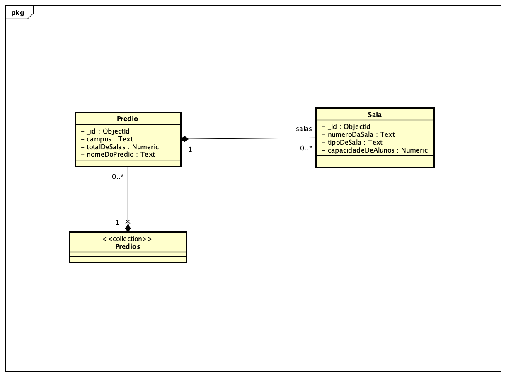

# constr-sw-2020-1-grupo5
Repositório de artefatos do Grupo 5 da turma 2020/1 de Construção de Software da Escola Politécnica da PUC-RS

Keycloak na Amazon = http://ec2-100-27-21-110.compute-1.amazonaws.com:8080/auth/

Caso de teste para o postman = http://ec2-100-27-21-110.compute-1.amazonaws.com:3456/login

Body = 
    {
        "login": "alexandre",
        "password": "abc123"
    }

